# Workshop-Minishift-and-MachineLearning

![redhat][img-redhat]][url-redhat]

# Red Hat OpenShift Container Platform<br>

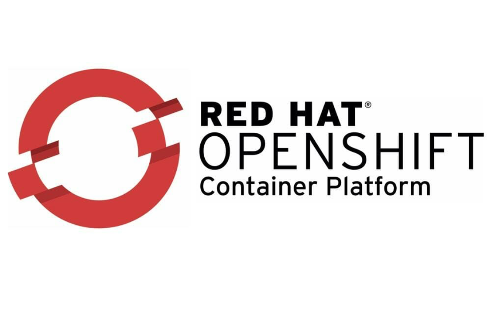

**Red Hat OpenShift** es una plataforma de contenedores de Kubernetes empresarial con operaciones automatizadas integrales para gestionar implementaciones de nube híbrida y multicloud. **Red Hat OpenShift** está optimizada para mejorar la productividad de los desarrolladores y promover la innovación.
* [![openshift][img-openshift]][url-openshift] Para mayor información.

## IBM Developer Advocate Team.

## PreWork:<br>
Para instalar un **Hypervisor** para la creación de un cluster en **OpenShift**.
<br>

**Hypervisor** dependiendo del sistema operativo:
* Para Linux: [KVM driver][url-kvm]
* Para macOS: [hyperkit driver][url-hyper]
* Para Windows: [Hyper-V driver][url-hyperv]
* Para VirtualBox (all platforms): [Minishift para VirtualBox][url-VBminishift]
<br>

Para descargar **Minishift**: [Minishift][url-minishift]
<br>

## Hands-On
El código en este repositorio está estructurado para entrenar una red neuronal y desplegar una app que hace uso de ella.
El objetivo de este workshop es obtener los beneficios que tiene Minishift de obtener código de un repositorio centralizado y desplegarlo.
1. Haz fork a este repositorio (link) para que tengas tu propia copia del proyecto y seas capaz de hacerle cambios.
2. Clona tu repositorio a tu sistema local
``` bash
    git clone <URL de tu repo>
```
3. Ahora un pequeño tour al pequeño proyecto que recién copiaste.
	- app.py - El puno de entrada principal para nuestro programa. Minishift buscará y ejecutará éste script.
    - requirements.txt - Documento de texto que contiene las dependencias que nuestro proyecto necesita instalar para que nuestro programa funcione.
    - server.py – El Código que servirá para predecir.
    - train.py – El código que contiene nuestra red neuronal el cual se comenzará a entrenar la primera vez que corramos nuestra app.


4. Es hora de iniciar el servidor de Openshift.
    - Para iniciar el servidor de OpenShift teclea en la terminal lo siguiente.
    ``` bash
    minishift start --vm-driver <driver>
    ```
"driver" es el driver que has instalado en el pre-work para crear el ambiente virtualizado donde se creará el cluster de **OpenShift**. Ej. ‘hyperkit’ o ‘virtualbox’.
Si solo has instalado uno, bastará que solo escribas lo siguiente.
``` bash
minishift start
```

5. Una vez hecho esto te debera aparecer la dirección de la UI de OpenShift el cual copiaremos y pegaremos en nuestro buscador.

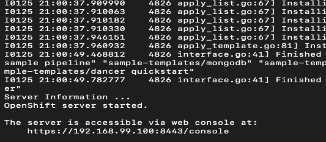
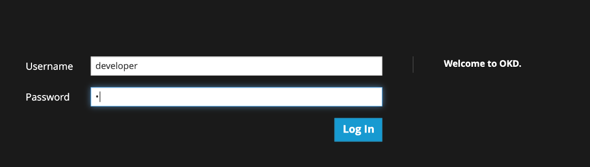

6. Escribe "developer" en el username y cualquier carácter en "password".
7. Has entrado a la UI de OpenShift. Ahora da click en botón que dice "Python".
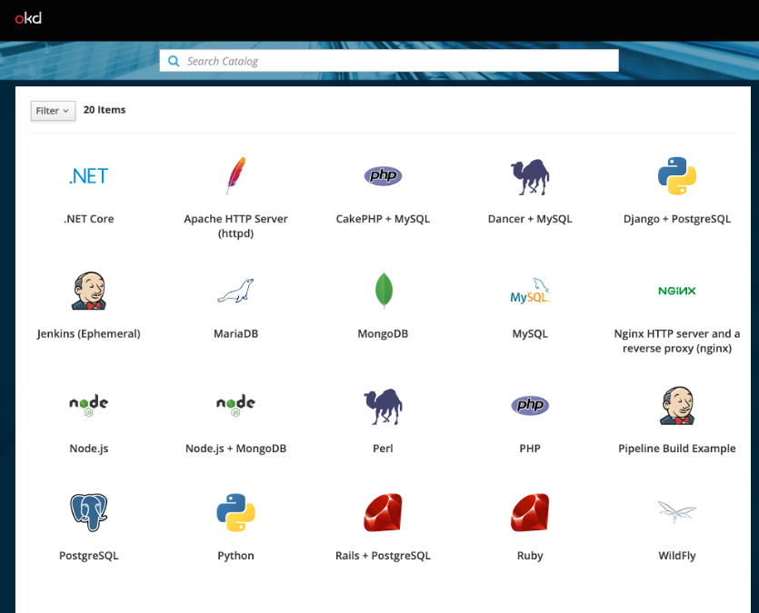
8. Llena los siguientes campos con los siguientes valores o con los que desees.
``` bash
    Project Name = keras-mnist
    Project Display Name = Keras + MNIST
    Application Name = mnist-recognition
    Git repositopry = <Es la URL de tu repositorio de GitHub>
```
9. Da click en "next".

10. Dirigete a "build" y luego a "logs" para que monitorees como va el build (que se hace de forma automática) de tu app.
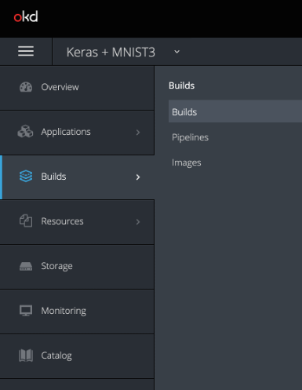
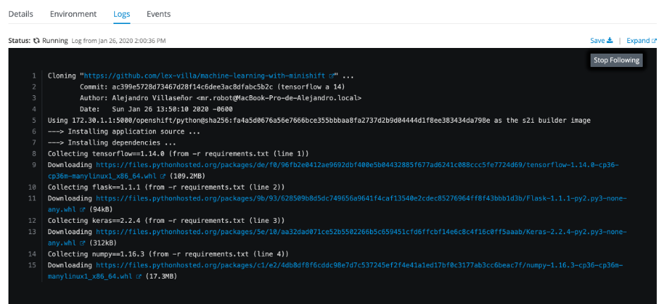
<br>

11. Una vez que el build a finalizado el entrenamiento de la red neuronal comezará. Dirigete a "Applications" > "Deployments" y luego a "logs" para que veas el status del entrenamiento de la  red neuronal.

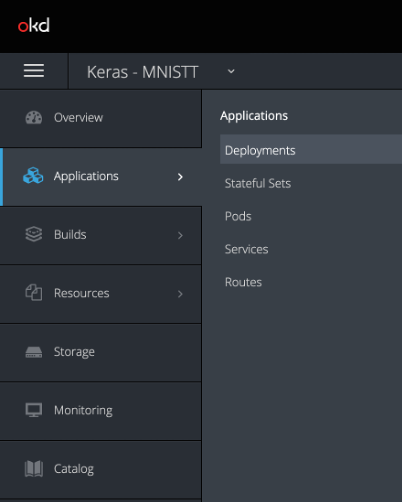
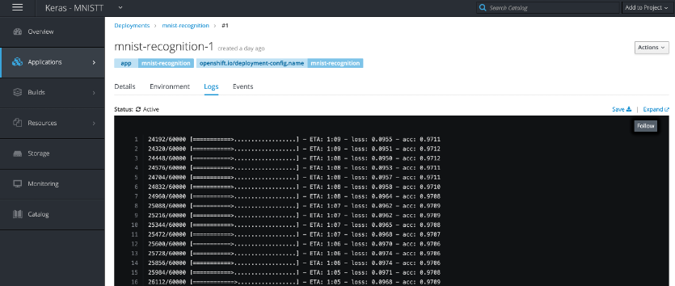

12. Despues de que nuestro modelo ha terminado de entrenarse, nuestro servidor permitirá a nuestra web app hacer uso del modelo recién creado.
13. Nos dirigimos a "Applications > "Routes" y ahí seleccionamos nuestra app y veremos una ruta que se a expuesto de manera automática, damos click para acceder a nuestra app.

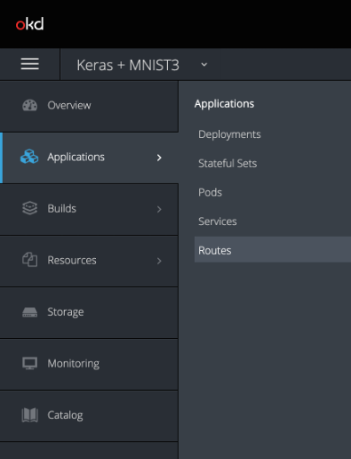
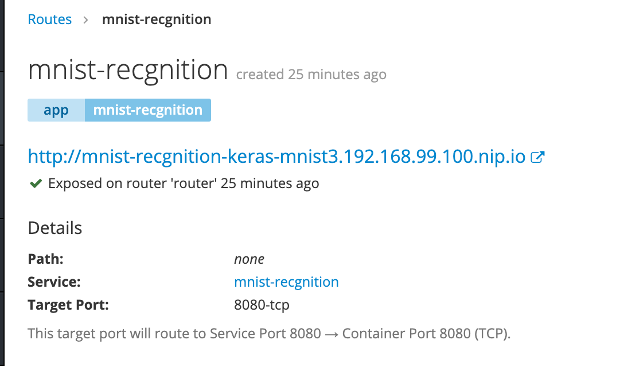

14. Ahora puedes dibujar un número y nuestra red neuronal lo clasificará.

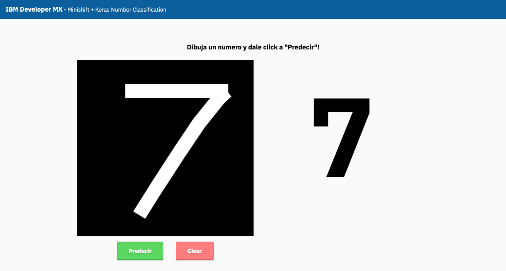


[img-redhat]: https://img.shields.io/badge/Red%20Hat-Powered-red.svg
[url-redhat]: https://www.redhat.com/es
[img-openshift]: https://img.shields.io/badge/Red%20Hat-Open%20Shift-red.svg
[url-openshift]: https://www.redhat.com/es/technologies/cloud-computing/openshift?intcmp=701f2000001OEGrAAO
[url-kvm]: https://docs.okd.io/latest/minishift/getting-started/setting-up-virtualization-environment.html#setting-up-kvm-driver
[url-hyper]: https://docs.okd.io/latest/minishift/getting-started/setting-up-virtualization-environment.html#setting-up-hyperkit-driver
[url-hyperv]: https://docs.okd.io/latest/minishift/getting-started/setting-up-virtualization-environment.html#setting-up-hyperkit-driver
[url-VBminishift]: https://docs.okd.io/latest/minishift/getting-started/setting-up-virtualization-environment.html#setting-up-virtualbox-driver
[url-minishift]: https://docs.okd.io/latest/minishift/getting-started/installing.html